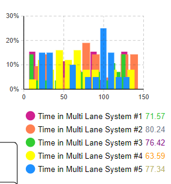

# Assignment 4 - DES (Queuing Theory, State Diagrams, and Markov Processes)
Discrete-event Simulation Assignment

> * Participant name: Maxwell Stolarenko

This repository is a reupload of a project I worked on as a Modeling and Simulation graduate student at the University of Central Florida to allow for public access. All work shown here was written by me.

## General Introduction

Discrete event modeling is the process of depicting the behavior of a complex system as a series of well-defined and ordered events. A discrete-event simulation (DES) simulates the operation of the system model as a discrete sequence of events in time. Each event occurs at a particular instant in time and marks a change of state in the system. Discrete-event simulation is used to simulate components that normally operate at a higher level of abstraction than components simulated by continuous simulators.

This assignment will look at two DES systems:
* Queues (*Target vs. Kohls*)
* State Diagrams

## Part 1 - Queues (AnyLogic) - (65%)

Queuing theory deals with problems that involve queuing (or waiting). Typical examples might be:
* banks/supermarkets - waiting for service
* computers - waiting for a response
* failure situations - waiting for a failure to occur e.g. in a piece of machinery
* public transport - waiting for a train or a bus

As we know queues are a common every-day experience. Queues form because resources are limited. In designing queueing systems we need to aim for a balance between service to customers (short queues implying many servers) and economic considerations (not too many servers). Note here that integral to queuing situations is the idea of uncertainty in, for example, interarrival times and service times. This means that probability and statistics are needed to analyze queuing situations. Typically we can talk of this individual sub-system as dealing with customers queuing for service

* Read and follow along with the [**Bank Office (Queueing System Tutorial)**](https://anylogic.help/tutorials/bank-office/index.html) from the [**AnyLogic Help**](https://help.anylogic.com) -- tutorials page. 
This tutorial explains very well where the features are and some insight where and what is built into AnyLogic.
* Review the [**Probability Distributions**](https://anylogic.help/anylogic/stochastic/probability-distributions.html) found in AnyLogic Help -- Advanced Modeling with Java -- Probability Distributions (* I Personally found this oddly buried in the help docs...*)
* Review the [**Process Modeling Library**](https://help.anylogic.com/index.jsp?nav=%2F2_0) - specifically I would focus on the [Process Modeling Library blocks](https://help.anylogic.com/topic/com.anylogic.help/html/_ProcessModeling/PML_Blocks.html?cp=2_0_1) since it has helpful documentation on the queue features.
* [**Collecting Output Data**](https://anylogic.help/anylogic/analysis/output.html) has some good information about [Statistics](https://anylogic.help/anylogic/data/collections-statistics-api.html#:~:text=AnyLogic%20provides%20functions%20to%20collect%20statistics%20on%20elements,global%20%28accessible%20from%20each%20place%20of%20model%20code%29.) and other output data features.

**(A)**.  We will be looking at the queues from Assignment 3's seaport container terminal system(s). Therefore, it is important that these terminals operate optimally to reduce costs and increase cargo flow. For this assignment, we assume this seaport terminals system operates in four subsystems: (1) routing, scheduling, and queuing ships to available berths; (2) waterside ship berth container unloading; (3) landside container yard storage; and (4) landside container shipping through trucks and trains.

> * **For this part of the assignment you will evaluate both models (in AnyLogic) and motivate which model is better and why but comparing the simulations of the models.**
> * Assign cost values to the trucks operating. 
> * Track and visualize metrics of the two systems. Write up your findings. For example - some metrics may include queue length, truck utilization, cost, and the number of trucks active (or idle) in the system...
> * (We expect a good write up on this looking at the graphs AnyLogic can produce.)

We will first look at two different approaches to moving cargo off the ships - first each birth will have its own queue of trucks to move the containers to the shipyard. Second, there will be a single line and the trucks will go to the next available berth. Both models are visualized below.
 
## AnyLogic Model of Queues and Cargo Movement 
Below is a screenshot of my AnyLogic model looking at the two different approaches to unloading cargo off of ships and onto trucks to transfer to designated area storage areas. The left model and its logic underneath depicts a multilane port where trucks all originate at the bottom middle where they then can pick a direction to separately line up in one of the five different queues. 
The right model and its logic depicts a port's area arranged in such a manner that restricts the routes ground transportation can take. In order to access any of the five 
 
## Video Demonstration of the AnyLogic Model 
I've included a video demonstration of my model in motion [here](https://youtu.be/mSntMohdxqU). Alternatively you can click the below image to take you to the same page.
 

Some features you might want to look at:
* Different arrival and service times - and how that affects both systems. Do the systems react differently when saturated.
* How long does a customer expect to wait in the queue before they are served, and how long will they have to wait before the service is complete?
* What is the probability of a customer having to wait longer than a given time interval before they are served?
* What is the average length of the queue?
* What is the probability that the queue will exceed a certain length? (think holiday season/black Friday)
* What is the expected utilization of the server and the expected time period during which he will be fully occupied (remember servers cost us money so we need to keep them busy - I mined the hourly data from glassdoor.com above).
* In fact if we can assign costs to factors such as customer waiting time and server idle time then we can investigate how to design a system at minimum total cost. 

### Different Arrival and Service Times 
Various metrics can be modified to produce results different from the initial video run but continue to produce resuls similar in nature. In the model, the source block dictates how frequently new customers/transporters will appear within the system while the service blocks are responsible for fulfilling the customers/transporter's requests before sending them off. In both systems, the servers are represented as the staff that unload cargo off trucks and into land storage or trains. All demonstrations used the same arrival and service rates for both systems to provide a more accurate comparison. 
 
This first figure above shows the results of running the multi-line/mulit-server simulation with an arrival rate of 1 customer every minute. The queues for each of the five servers were unable to keep up with the rapid influx of customers and as time went on the backlog only grew worse. 
  
The second and third figures above show the result of running both simulations with an arrival rate of 0.4 customers every minute, increasing the time between each arrival by more than twice the amount. The resulting product are two systems that can function with no issues for as long as the software allows. We also see both systems develop normal distributions with much shorter average wait times for customers in each line. 

Both systems behave in the same manner: both are unable to keep up with faster arrival rates and gradually develop longer and longer average wait times. The only difference between the two ,however, is that the single-line system eventually breaks from being unable to house so many customers at once while the multi-line system can keep holding customers in its queue. 
### Customer Waiting 
 
When looking specifically at how much time the average customer (or in this case the offloading truck) has to wait before being served, we look more towards the single-line/multi-server structural design. The distribution of wait times within the single-line design more closely resembles a right skewed distribution where most of the customers had below average waiting times, indicating that the single-line design is better suited for getting customers in and out faster than usual. The multi-line design resembles a uniform distribution where no one amount stands out as the average wait time, indicating that using the multi-line system can be unpredictable at most times with how long one would be forced to wait. 
### Exceeding Expected Wait Time Intervals 
The probability of a customer taking longer than the expected wait time to be served depends on the ratio between their rate of arrival and the rate at which the server can provide service to them. In a single-line/multi-server system, a customer waiting in line does not have choice or any control over their circumstances in line as everyone has to move in a uniform fashion. In contrast, the multi-line/multi-server system allows customers the freedom of choice to observe the system's current situation and select the shortest line. Each line in the multi-line system has its own different anticipated wait times based on how backed up they each are, and that freedom of choice smooths out each line to have generally the same mean waiting time.
 
### Average Queue Length 
 
Repeated runs of both simulations showed that the multi-line/multi-server design performed better than the single-line/multi-server design in term's of the average length of queues leading up to trucks performing their unloading task. Both simulations have the same arrival and delay rates but the single-line system cannot keep up with the number of requests all at once. If a server can take care of a customer once every 1.2 minutes instead of one customer every 1 minute, there immediately exists an unbalanced ratio between servers and customers in the customer's favor. An extra 12 seconds per customer doesn't sound bad but an extra 12 seconds for 122 customers eventually offsets the system by over 24 minutes. A customer that should have been handled in a little over a minute will now take over 24 minutes to be attended to. 
### Exceeding Queue Length 
Witihn the single-line system, a customer having to wait more than the average wait time is unlikely under normal circumstances. In special cases where there is rapid influx of customers at a given moment like holiday seasons, the single-line/multi-server design begins to fall apart.
The multi-line system may be able to keep up with holiday shopping sprees as the organization is well aware of when these events occur, opting to have more servers in-service to anticipate the rush. In real-life settings, queue lengths only get out of hand when the amount of available servers are insufficient for a given population. Server populations for a system are often kept scarce to reduce unneeded costs but special events use extra servers to offset the extra customers.  
### Utilization of Servers 
The nature of a server is to be attending to incoming customers to reduce the population of existing customers within a given system. Reducing the number of current customers allows for new customers to enter the system to continue the process. Servers in retail systems commonly face periods of the day where there is an increased volume of customers within the system and the server cannot realistic keep up with all of them enough to maintain the system's efficiency. When applying this concept to a maritime port, ground transportation units are constantly moving containers around the facility to their destinated locations wheter it be onto a train, a storage yard, or to incoming ships. A server in a maritime port system will be fully occupied whenever a new ship docks at their port for unloading or loading, as they have to initiate the process of unloading and transporting goods to their required regions in the facility. 
The servers, or transporters, for both the multi-line/mulit-server and single-line/multi-server layouts have are responsible every day for the safe and efficient transportation of solid, liquid, and delicate products. They are responsible for communicating with the rest of their workforce team, including those clocked in and working alongside them and those that work the next shift by relaying the exact same instructions they themselves followed that day. Transportation and similar port operators are required to record and track each task they perform and the hour each task was started and completed including every container they transport, their corresponding country of origin, company of origin, and tracking number. Anything a server's supervisor requests the server must perform, even if it disrupts their own schedule. All the while the server must be constantly aware of the port's recurring policies and deadlines in accordance with maintaining workplace safety and logistic upkeep [(SUNY Maritime College.)](https://www.sunymaritime.edu/sites/default/files/media/Documents/Terminal%20Operator%20Position.pdf) 

_Source: [Lloyd's List, 2019](https://lloydslist.maritimeintelligence.informa.com/LL1126570/Blackstone-invests-in-marine-terminal-operator-Carrix)_ 

Using human servers in a port for the purpose of transporter containers from one area to another requires having said servers being utilized to their fullest potential as much as possible, as servers that do not have any assigned tasks will cost the organization reduced revenue that day. Utilizing the port's servers to their fullest requires administering a series of tasks upon them that not only keep them engaged and accomplish their primary objective but to increase the value their work brings to the organization from securing future revenue. Maintaining work equipment and vehicles, keeping detailed logistics, and following proper organization and communication channels helps prevent financial loss from human error and utilizes the server in a more efficient manner. 
## Designing a System at Minimum Cost 
Cost to an organization is not always the poor result of putting money in the wrong places, but rather the product of the organization's inability to secure sufficient profit. A broken vehicle costs a company because they need to repair or replace it, but a customer waiting in queue or a server with no customer to attend to cost the company because they are spending money on unused assets. A system will always have costs, so the ideal solution to working arounds costs are to offset them with profits. A constant stream of customers and busy servers guarantee that profit is going into the system, but developing efficient techniques can tilt the cost-gain dynamic further in the system's favor. Automating the servers is one such way to achieve this, in which the servers will be able to work 24 hours a day, and track customer and site logistics simultaneously.  

**(B)**. **Is the following hypothesis true - A single line with multiple servers is more efficient (and cheaper) than multiple lines and multiple servers.**  
Multiple runs of my AnyLogic simulation with different initial conditions like arrivals rates, arrival times, queue capacities, and delay times indicated that both simulation designs perform very similar to each other. If we define efficiency in terms of the raw number of ground transports completing a full task cycle through the port then both port layouts are equally efficient within the created logic. If we define efficiency by how fast each layout completed a transport's cycle then the single line with multiple servers was more efficient. The average transport spent less time in queue with the single line/multiple server design than the mulitple line/mulitple server design, starting with a small difference in average wait times near the start of each simuulation but the gap in times between the two simulations constantly grew as the simulation continued. 

In other words, the layout with multiple lanes performs slightly slower for each trasnport but having multiple lanes allows for a higher maximum capacity.

Cost-wise it is hard to say which design would be better to implement because they each have their own drawbacks that could make operations more costly than needed. The multi-line/multi-server design is prone to periods of short wait times as well as periods of longer than average wait times, which could slow down operations for the whole facility. On the other hand, the single-line/multiple-server design in my model repeatedly exceeded its maximum capacity and forced the simulation to stop early, which would signficantly cause financial loss to the facility. 

To sum it all up, the single-line/multiple-server layout provides efficiency with shorter and consistent wait times for its queues but is prone to overcrowding. The exceeding capacity issue may be a technical problem with how my model is designed so I am reluctant to say such an outcome is bound to happen with similarly designed ports. Should the two port layouts continue to function in the simulation uninterrupted, the gap between average wait times would become more and more noticable for the multi-lane/multi-server layout.  

**(C)** How does the automatic vs truck offloading system change the system metrics?

For the case of the models developed in AnyLogic, it is hard to generate non-automatic processes as everything functions the way it is expected to within a simulation. Variation among automous agents is often how simulators replicate the sense of human-operated systems but can only be done so with limited variability. With the two port queue systems, non-autonomous variability was generated with varying arrival rates ranging from periods of constant vehicle arrivals to calmer periods with fewer vehicles. 
Developing an offloading system to become entirely automated suggests that the average time to complete a given task would be consistent with very little variation across each case, unlike when using manual truck offloading systems. Implementation of automatic offloading systems can improve cost efficiency and other similar metrics relating to efficiency, primarily by promoting consistency with little worry of any inidivudal task slowing down the rest of the operation. Slower operations mean less total transported goods which can become costly for an organization over time. Similarly, more automation takes the human out of the loop in many tasks which in turn reduces or completely removes the risk of human error and the cost of injury or malpractice from occurring [(Interlake Mecalux, 2021)](https://www.interlakemecalux.com/blog/automatic-truck-loading-unloading-systems). Promoting human safety with an automated offloading system overall lowers operation costs of a facility by requiring less humans working at a given time. Similarly, automated systems like automated ground vehicles can operate 24 hours a day so operations can continue over night.

## Part B - State Diagrams and Transition Matrices (35%)

**(A):** Here is a state transition diagram for Non-player characters (NPC) for a video game DTMC (Discrete-Time Markov Chain).

write out the transition matrix for this state-diagram. 

### Transition Matrix for State-Transition Diagram: 
The following transition matrix details the probability of moving from one state to another based on the diagram provided above. The state of Standing can transition to any of the other states as well as itself, while the states "Run," "Sit," "Swim," and "Jump" can only tansition back to Standing or to continue in their current state. The only exception to the looping rule is Jumping. In designing a realistic setting, you cannot stay in a state of jumping but you can remain in any of the other states without having to forcibly change oneself.  

| Stand | Jump | Swim | Sit | Run |
| ------------- |:-------------:| -----:| -----:| -----:|
| 0.2 | 0.2 | 0.2 | 0.2 | 0.2 |
| 0.667 | 0.333 | 0 | 0 | 0 |
| 0.15 | 0 | 0.85 | 0 | 0 |
| 0.25 | 0 | 0 | 0.75 | 0 |
| 0.8 | 0 | 0 | 0 | 0.2 |

**(B):** Here is a transition matrix for a Discrete-Time Markov Chain. **Draw** the state-transition diagram that represents it. 

|         |            |   |   |   |   |   |   |   |
| ------------- |:-------------:| -----:| -----:| -----:| -----:| -----:| -----:| -----:|
|0.1|0.1|0.1|0.1|0.1|0.1|0.1|0.1|0.2|
|0.333|0.|0.333|0.|0.|0.|0.333|0.|0.|
|0.|0.|0.333|0.|0.|0.666|0.|0.|0.|
|0.25|0.|0.|0.|0.|0.|0.75|0.|0.|
|0.3|0.4|0.|0.|0.3|0.|0.|0.|0.|
|0.1|0.|0.|0.|0.|0.9|0.|0.|0.|
|0.2|0.|0.2|0.|0.2|0.|0.2|0.|0.2|
|0.5|0.|0.|0.|0.|0.|0.|0.|0.5|
|0.|0.3|0.|0.05|0.05|0.|0.3|0.2|0.1|

State-Transition Diagram for Transition Matrix:
 
Pictured above is a State-Transition diagram for the transition matrix chart listed above. Not much can be said about this since the transition matrix didn't state what each state represented so real-world counterparts cannot be applied outside of the provided probabilites. Color and the previously listed probabalities were included in the diagram for clarity.

